# Achieving Bliss Part 1: Reenabling 0SP POST codes

## Prelude

This is my first blog post about reproducing the very cool Xbox One glitch attack, aka the "bliss" hack or "bliss" attack, originally presented by Markus Gaseeleden at Re//verse conference 2026.

Since the release of the talk recording in March I've been somewhat continuously trying to reproduce the glitch attack. This first post will document what I did to achieve the first glitch attack of the 3 presented by Markus.

My objectives publishing this post are basically 2:
1. Having a future reference for myself so that I don't forget about details
2. Posting my specific unusual/cursed solutions I found to the different setup/hardware challenges in case they are useful for other folks reproducing.

I've tried at times to stay away from the setup/attempts other people have been doing to force myself to learn and solve the problems without shortcuts, although I've had to learn a lot from folks to even get here and I appreciate the crosspolination that happened. Let's go

## Quick Attack Overview

The first glitch shown by Doom is only partly useful in the big scheme of things (obtaining a full Xbox One unpatchable hack) but is mostly intended to demonstrate that it is possible to glitch the Xbox One's secure processor's first bootloader (called 0sp).

The principle behind it is simple, POST codes tell the status of the system and the progress of the boot process. They could be used as anchors for fault injection by attackers, so Microsoft disabled them in the 0sp and 1sp, by burning this configuration into fuses (aka: fusing off), reading this configuration, and deciding wether to output or not these codes. However, there is a small side channel that discloses when the instructions that check these conditions will run.

As discovered by Markus, when the GPIO's of the SoC are configured (configured as outputs, GPIOs can usually be either inputs or outputs) the signal electrically stops from being floating/HiZ/tristate, to being a logic '0' or LOW by default (food for my own thought, are there uCs or chips out there in which the default GPIO output state is HIGH instead?). In terms of voltage, this just means that the GPIO driver passes from, not driving the pin (thus you see pretty much the SoC and ambient electromagnetic noise, around 100mv or 200mv usually), to driving the pin (you see plain 0.00v).

This change can be used as anchor/trigger to know when the secure processor is almost about to run code that checks if the POST codes should be enabled or not. Let's see how to actually implement the detection of such event and inject a glitch on it.

## My Tools

This is roughly all the hardware that I've used:

- ~~Chipwhisperer Lite~~ (initially but i think i ended up burning its mosfet)
- Teensy 4.1 Microcontroller
- LA2016 Logic Analyzer (not really used in this first glitch)
- Siglent SDS804X HD (software-hacked to the superior SDS824X HD model)
- TXS0108E bidirectional level shifter (Used this to turn the 1.8v POST signals, into 3.3v signals that the Teensy can work with. If a microcontroller that works at 1.8v logic level is used, this is mostly not necessary)
- Off-the-self electronic components: resistors (through hole and SMD), capacitors, diodes, etc.
- Si2302 MOSFET transistors
- **DMG2302U-7 MOSFET** transistors
- **UCC27517DBVR Gate Driver** for the transistor

## Cursed part selection

If you were to carefully review the datasheets of the components I've listed above, specially the Si2302 and DMG MOSFET choices, you would notice that it might not be the best part for fault injection. Let's talk about this

For voltage glitch attacks, aka crowbar circuit-based voltage attacks, what you want to do is basically take the target power rail (V_NBCORE in the case of the Xbox One bliss hack, the NorthBridge Core rail) and very very briefly (in the order of nanoseconds) remove power from it. This will make the (CMOS) transistors backing the logic gates (which in turn back the multiplexers, decoders, adders, etc of the chip) operate under less power than they truly need to work properly, but without shutting down the whole circuit. Ideally, this produces logic bugs (a '0' where a '1' should be, or the other way around) that can propagate down any sequential logic, altering results of operations.

**However, the voltage regulators of the motherboard that power up the SoC rails, will try to prevent this at all cost.** They are usually very fast ICs that can react quickly when they detect the voltage is going down, and try to push it up harder and better back to it's intented voltage (V_NBCORE is a 1.2v rail btw).

To achieve a sharp glitch (more about what this means in a bit) you basically need a MOSFET that switches as "fast" as possible and that has as small resistence as possible. For MOS type fets we want to look at the `Rds(on)` value of the datasheet, which as the name implies tells us: the Resistance, between the Drain and Source pins of the device, when the mosfet is "on". This is the first parameter we want to "optimize" when buying for parts, the lower the `Rds(on)` the better and cleaner the target rail signal will sink to 0v.

The second parameter to optimize for I have just sneakily mentioned it in the previous paragraph. It's how fast you can open the MOSFET. This is determined by 2 things:

1. Its `Vgs(th)` or "Gate (to source) Threshold Voltage". It defines what voltage value you need to apply to the gate of the transistor (relative to the voltage at the source) to open the channel and make the mosfet conduct.

2. The Gate Charge `Qg`: for simplicity, the gate pin can be considered as if it were a capacitor. When you charge it, the mosfet channel opens, and until the gate charge is discharged, the fet will remain open. This charge is measured in nanoculomb (nC) which is basically Amps per second. In other words, this means _whatever_ will activate the mosfet's gate, should be capable of providing as much amps as possible per unit of time (to charge the gate as quickly as possible). As a corollary, the biggest the gate charge value of the fet, the longer it'll take to fully charge it and open the circuit (that is bad for our case).

There are other parameters of the target to consider. `V_NBCORE` is a rail that supplies up to 4A of current to the SoC (A LOT).

**Anyways, here's the thing**: both the Si2302 and the DMG2302U are suboptimal when it comes to these parameters!!!

Check this quick comparison and we're almost done with the boring part, **I promise**. At (3.6A, Vgs=4.5V) the two fets compare:
- Si2302 is a classic MOSFET used in voltage glitching papers agaisnt microcontrollers. It has `Rds(on)` = around 85-100 mOhm. And `Qg` = 5.5nC.
- DMG2302U is one the different MOSFET models **used in Nintendo Switch modchips**. It has `Rds(on)` = around 50mOhm. And `Qg` = 1.9nC.

There's _one more relevant parameter_, the `Idm` which TLDR: represents the maximum current can flow safely w/o damaging the mosfet when the channel is open. I won't ellaborate further. DMG2302U wins in the previous parameters, and also wins here with `Idm` = 15A versus Si2302's `Idm` of 10A. This is great because any overshoots above these limits will damage the fets.

Initially I practiced a bit with the Si2302 fets against some microcontrollers and they absolutely obliterated them. The microcontroller power rails will go to 0v very fast and obviously reset. The Teensy, using it's 3.3v GPIO, can drive the mosfet directly:

Note that the GPIO of a microcontroller like the teensy can only output about 10-40mA of current (and like we said above, that's bad) but even that's enough to drive the fet and glitch a small microcontroller.

##  Actually setting up the Xbox One motherboard

Thankfully in the case of the Xbox One, there have been leaked Schematic and Board views out there for at least 4 or 5 years, which help a lot to locate useful points in the board where to solder your cables, undocumented otherwise.

### POST<0> soldering
(picture)

### Removing decoupling capacitors
(picture)

Capacitors will store charge, and fight back our glitch attempts by quickly dumping this charge into the rail when it lacks the necessary.

There's a bunch of capacitors that need to be removed:

- **Front of the mobo**: C6F8, C6F7, C4U6, C4U7, C4U8

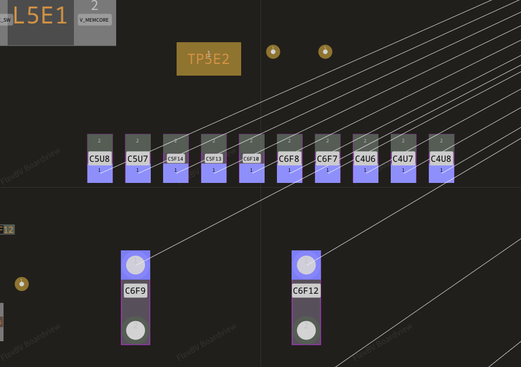

> The electrolytic capacitors should not be removed.

- **Back of the mobo (under the SoC)**: C3T32, C3T27, C3T36, C3T35, C3T31, C3T30, C3T28, C3T29. Up to this point, those are all that Doom originally seemed to remove. I also tried removing C3T25 and C3T26 and the console booted fine without those but I soldered them back again. Glitch was achieved without removing 25 and 26 (nor C3T24)

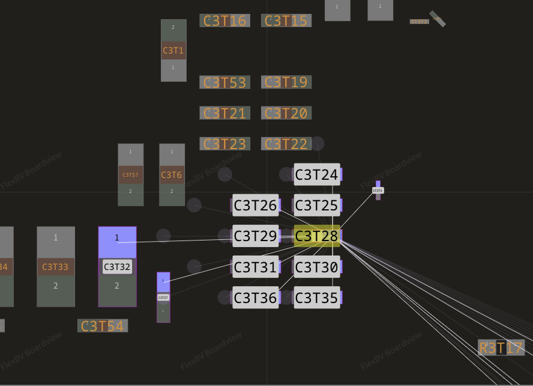

### Deadbugging Si2302 mosfet
So my first attempts at glitching the Xbox one secure processor start by deadbugging soldering the Si2302. Basically, the source is connected to a GND pad (from one of the removed capacitors), drain is connected to V_NBCORE, and the Gate is not connected in this pic:
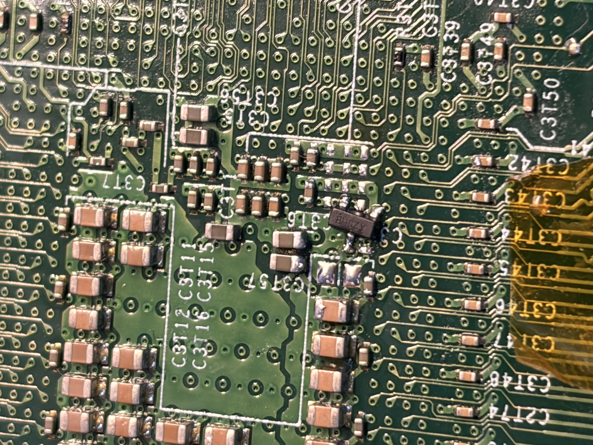

Later, i ran a cable from the Gate directly to my Teensy, something like this:

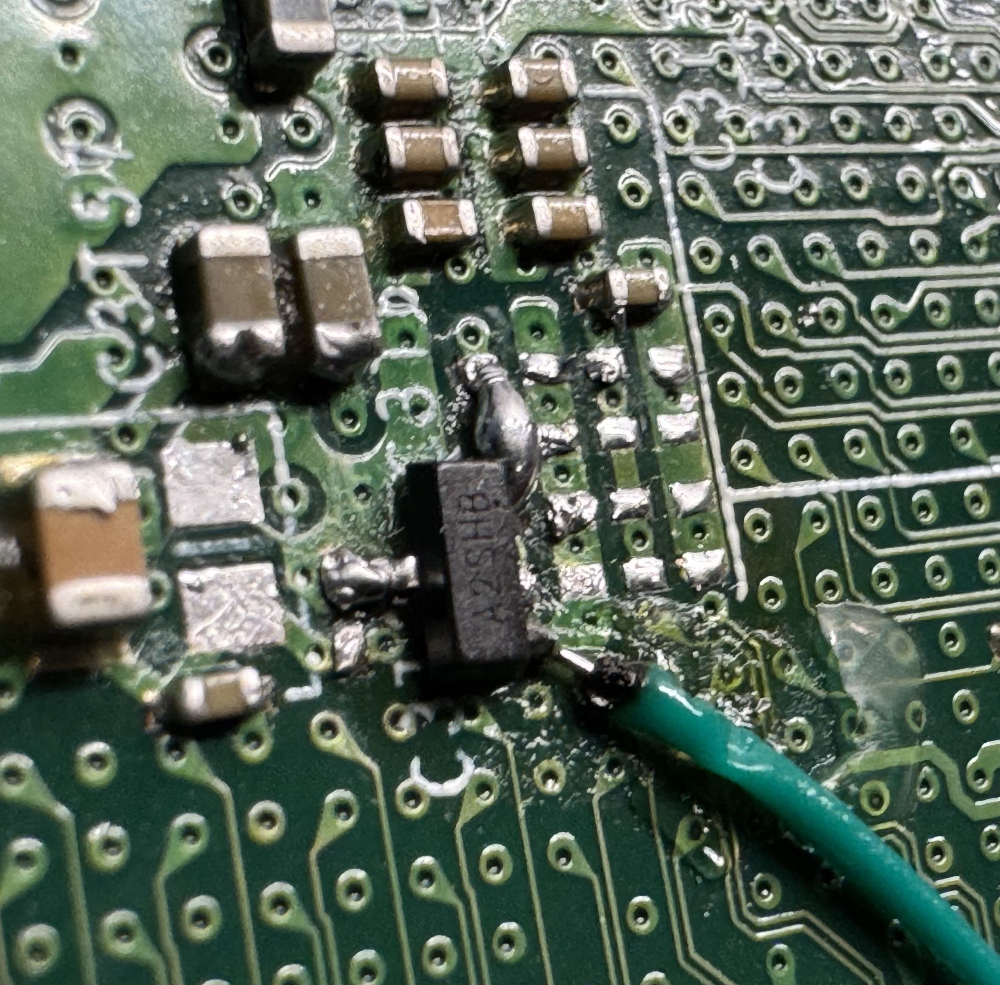

I also experimented with other positions and wirings:

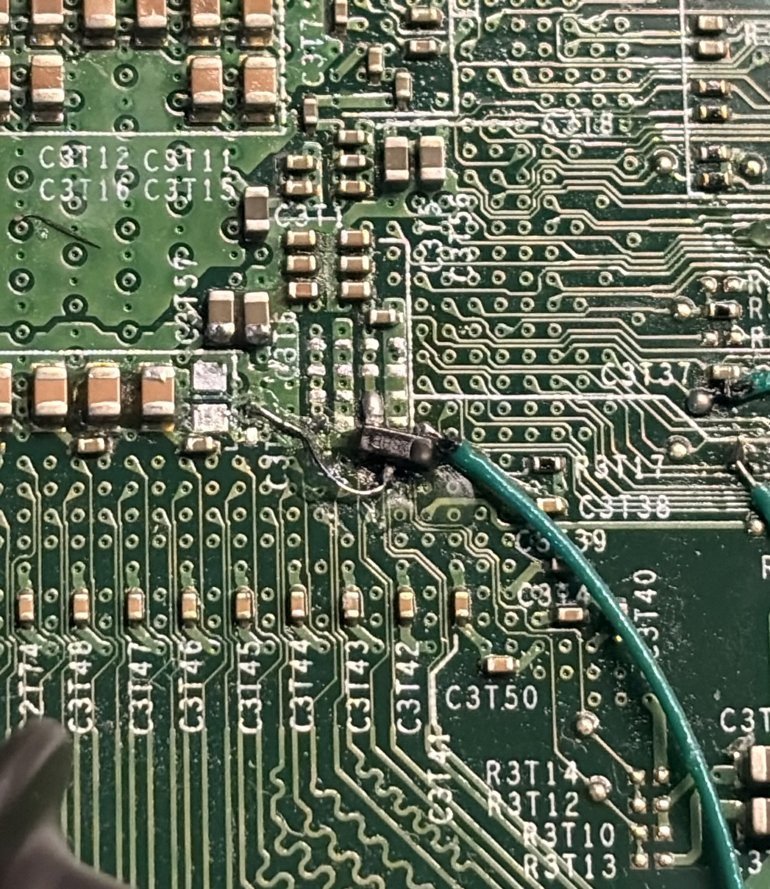

But ultimately the best is to solder the mosfet directly to the pads. Every inch of wire you add introduces inductance and limits how good and fast the crowbar will be, which in the case of a beefy Soc like the Xbox One's is critical.

And if then try to send a '1'/HIGH signal via the GPIO of our Teensy (green signal) then we can observe the first timid glitches being injected into V_NBCORE (blue signal):

Despite looking cool, notice how the voltage actually barely dips. It goes down from ~1.2v to barely 1.0v, not much, and definitely not enough to produce real glitches. Here, the glitch width was 100ns, but giving the mosfet more time to work by increasing the width to, say 200ns, did not help at all (lowest was still 1.0v) indicating the fet was at its limit, doing all it could with the current setup.

So far, it was being driven directly by the 3.3v GPIO from the Teensy which outputs 10-40mA at most. I did not try the Si2302 alone with a gate driver but it probably would have improved a little bit.

### Deadbugging DMG mosfet + Gate Drivin'

Let's try and switch to the DMG mosfet which we know has better specs anyways. In the way, I will also throw a Gate Driver to the equation, let me explain:

So far I had been driving the Si2302 directly from the teensy, meaning two things:
- The gate charge required is satisfied, yes, but slowly, because our pin only outputs a few milliamps taking time to charge it. (The electric field comes slowlier, and the n-channel opens more slowly)
- The voltage at which the gate is driven (`Vgs(th)`) is not optimal. The higher this voltage is (within the datasheet limits), the lower the resistance of the channel. A curve graph in the datasheet shows this. Usually at 4.5v it is the most optimal. From there up to the maximum (which for the DMG is ±8 V) the gains are not that proportional. Still you will see me play with this value in just a moment ;)

This was my first UCC27517DBVR deadbugged setup:

The gate driver needs a power supply through its `VDD` pin. And by the way, this voltage is also the voltage that it will output throught its `OUT` pin, the one going to the gate pin of the mosfet. This is very convenient, as increasing the power supply to the UCC27517DBVR results in increasing the Vgs(th) we apply to the mosfet. My setup corresponds very closely to the typical application recommended by Texas Instruments:

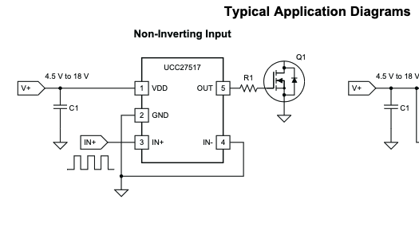

There is a C1 capacitor that must be added to the `VDD`to help maintaining a good supply when we activate the gate driver, since it'll dump a good amount of charge into the mosfet. You can see it in my setup. **I reused one of the `V_NBCORE` decoupling capacitors from the front of the motherboard lol**. GND goes to ground and `IN+` is our glitch enable, a square wave pulse from our Teensy for 100ns or 200ns. `OUT` connects to the Gate of the DMG mosfet.

With this I got a nicer glitch:
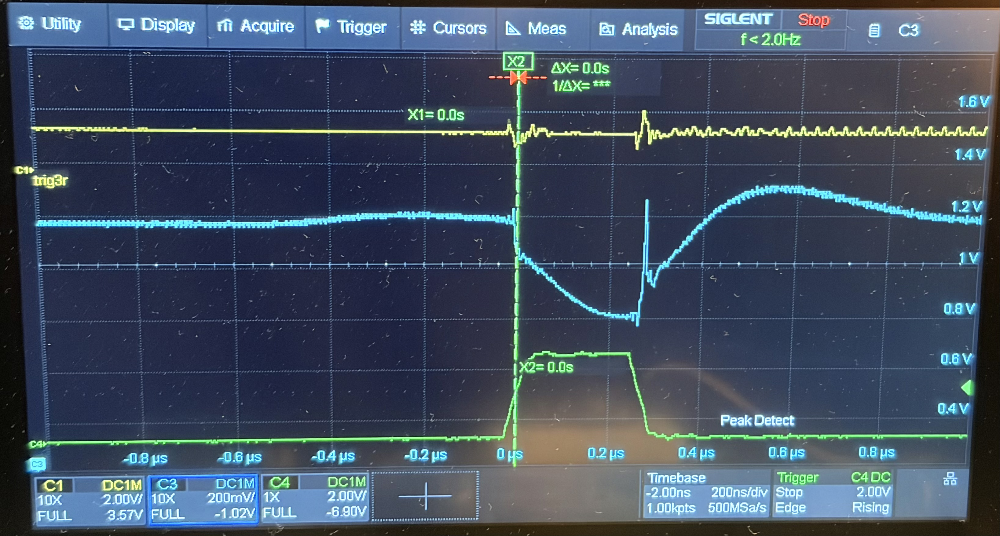

Hell yeah, downto ~0.8v!
At this point the gate driver voltage matters. At its max of 8v, is where I got this glitch. But if I drove it at, for example, 4.5v, I would only be able to get a dip downto ~0.7v.

Another peculiarity of my setup is that I'm powering the Gate Driver with a lab PSU like this:

This has two perks: first, I can tune the voltage to experiment very rapidly. But secondly, it allowed me to "disable" the gate driver by powering off the PSU and thus debug other parts of the setup (like the Teensy firmware, when debugging triggers, or other stuff). Notice that I braided the two cables of the PSU (voltage & GND) to avoid noise. Without this, at higher voltages, some EM noise would leak into my deadbugged ICs and probe cables, not affecting the setup, but very noticeable in the scope, distorting my square glitch enable signal from the Teensy and who knows what else.

Still these 0.8v glitches were not good enough to disrupt the operation of the Secure Processor. I would observe the boot process continue normally even if i injected my glitch at the right moment after the post<0> trigger.

### Deadbuggin a SECOND MOSFET??!?
This is where a sane person would have stopped and would go buy better components. However I decided to give it a try and glitch the shit out of the console with what I had (either way I would've needed to wait until new parts came wouldn't I?). Mostly, this helped me strengthen my knowledge about FET's characteristics, usual application circuits of FETs and other challenges.

So, what great idea did I come with? Well... what if we stacked 2 mothafucking DMG mosfets? We'd have double the capacity to drive V_NBCORE to GND. To be precise, we're adding a second channel, with the same Rds(on) as before, _in parallel_... And if you remember from high-school, when two equal resistors are added in parallel, the equivalent resistance is halved. So this makes our crowbar circuit even better. The `Idm` of both FETs also combine, allowing for a total greater current capable of passing through the whole contraption.

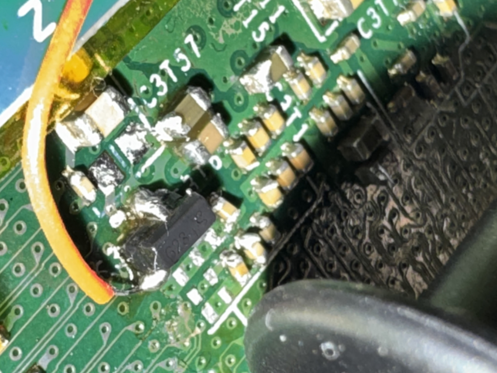
<centre>_Stacked FETS, Drains soldered together and to V_NBCORE, sources soldered together and to GND, gates soldered together and to cable going to gate driver._</centre>

There's nevertheless, a price to pay for this, which is double the gate charge `Qg`. But the gate driver was beefy and surely would barely blink, and this assumption was proven right. I was now getting glitches downto ~0.6v but there was an issue.

(_sorry forgot to take a pic of this_)

### First real "Glitch" + Taming the overshoots

At this ~0.6v glitch I started observing something. Specially when I crancked the gate driver to the max voltage, all my glitch injections would result in the console rebooting. Not only the SoC or the PSP, but the whole console. These glitches had the same effect that toggling SMC_RESET had (I know because until now I used SMC_RESET exclusively as my reset signal, I'm not using COLD_RESET).

Now, the culprit of all this is hiding in plain sight if you scroll up a little bit. It's this mf:
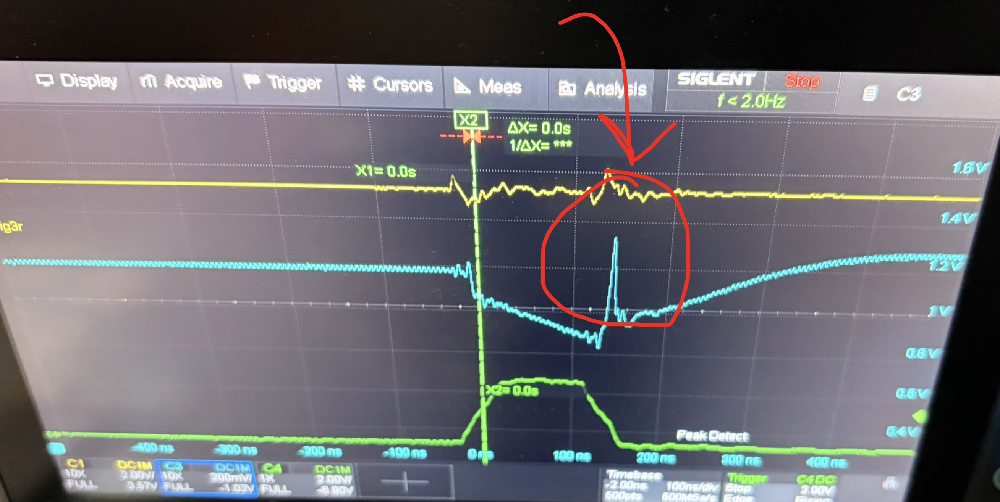

What you see there is a spike or voltage overshoot. Basically, after i disable the MOSFET abruptly, a huge voltage mountain appears. This is speculation, but I think `Q5F2` (the NTMF voltage regulator that generates V_NBCORE) through its feedback lines, detects this dangerous outlier and resets/shuts-down the SoC to protect it. It might actually be a sensor inside the SoC that is detecting it and asking the Southbridge to shut down, but i'm not sure.

Anyways, **we need to tame it.**

Again a different setup, with a single and better high-power MOSFET, probably doesn't suffer from this. Maybe there are other ways to make the gate discharge smoother and the mosfet's closure less abrupt, but I don't know about them (let me know if you know)

What i came up with was a small circuit to slow down the discharge of the gate (when we want to stop the crowbar) without affecting the speed when we activate the crowbar:

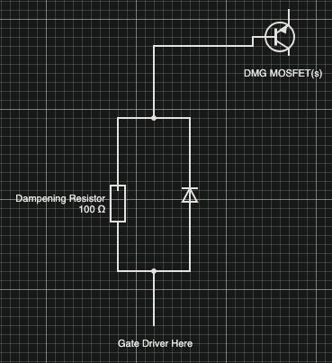

What this does is basically:
- When the gate driver tries to charge the mosfet, current flows freely* through the diode into the gate. Charging is fast
- When the gate discharges, current can't flow throw the diode in reverse bias. It must then flow through the dampening resistor slowing down the process

I didn't even have the right diodes for working with fast-ish signals at first so I used the world cheapest IN1004 diode available in any arduino learning kit:

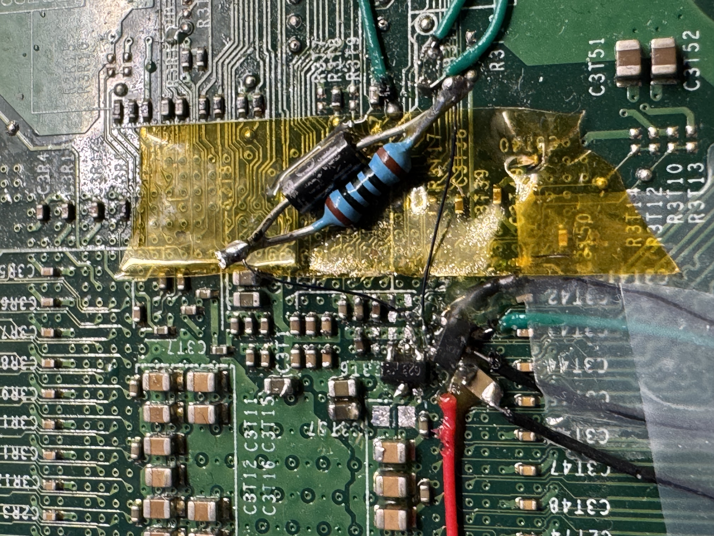

I bodged it inbetween the driver and the fet with some enamel wire, and some glue, and sure enough it worked:

(_i actually figured this out before I added the second fet hence smaller dip in the pic_)

Later, and after having the two powerful stacked fets, i finetuned the setup:

**A: width = 230ns , in4007 slow diode, gate driver at 8v output, x2 stacked DMG fets**
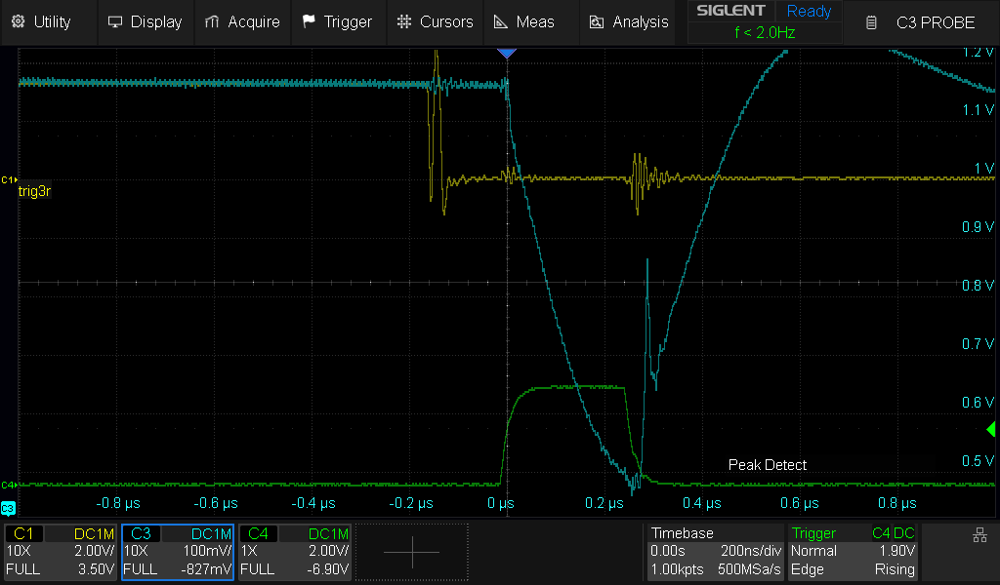

---

and after i got some proper diodes, it improved even more (the IN1004 are a bit slow so they might take a bit to stop conducting after quickly switching from forward bias to reverse bias):

**B: width = 230ns, fast 1N4148 diode, gate driver at 8v output, x2 stacked DMG fets**
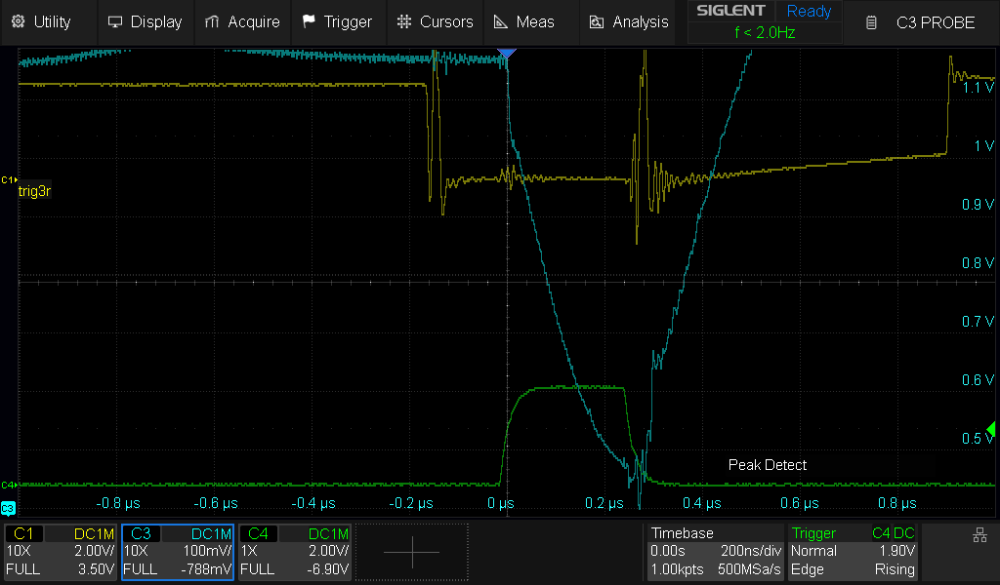

You can see the overshoot * almost * absolutely disappers.

**A scaled view of the glitch shape, almost around 0.4v:**
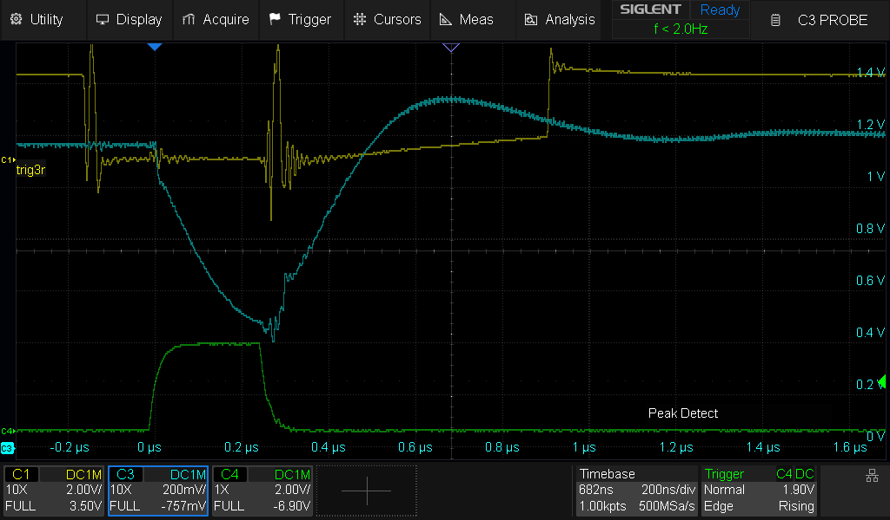

Now, with this shape, and injecting the glitch after the falling edge of the post<0> signal, I started observing some "logic" glitches (not full console resets, finally):

> Normal:

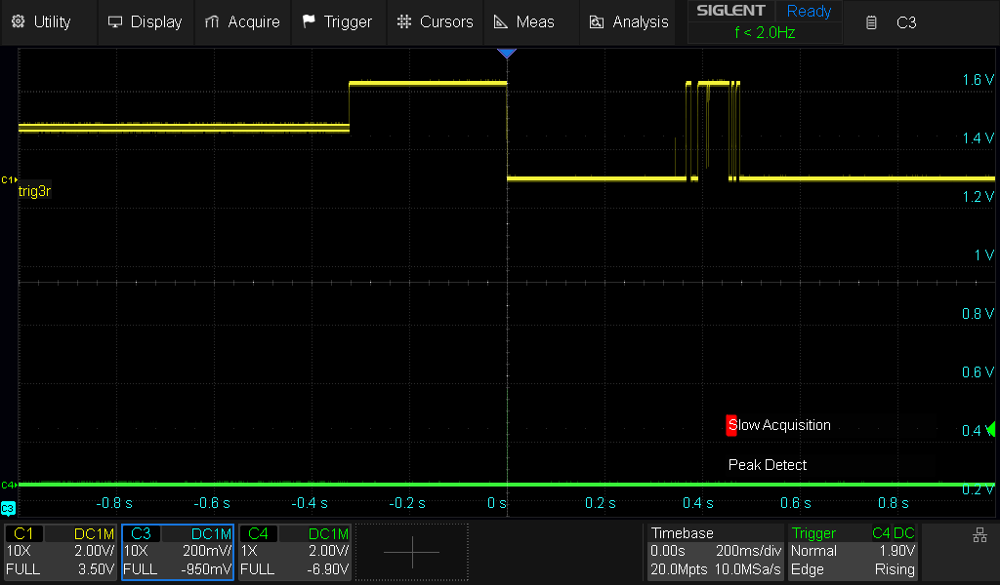

> Glitches:

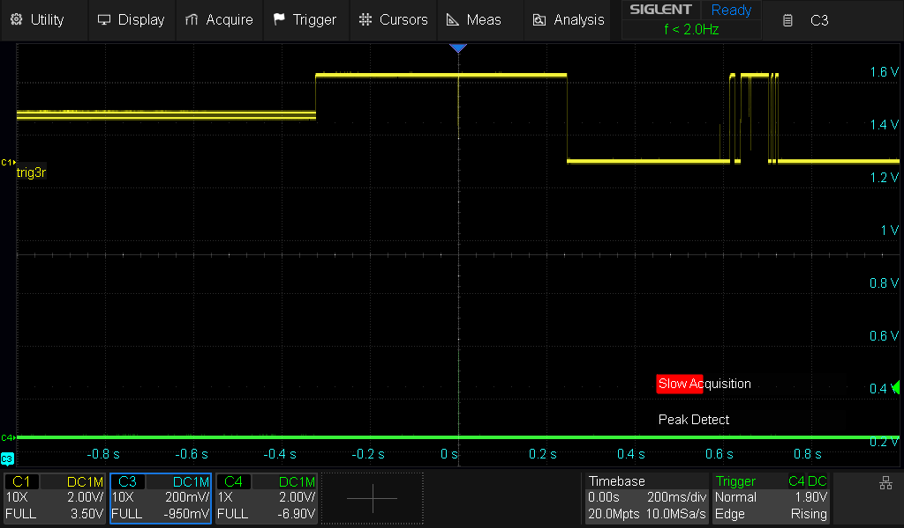
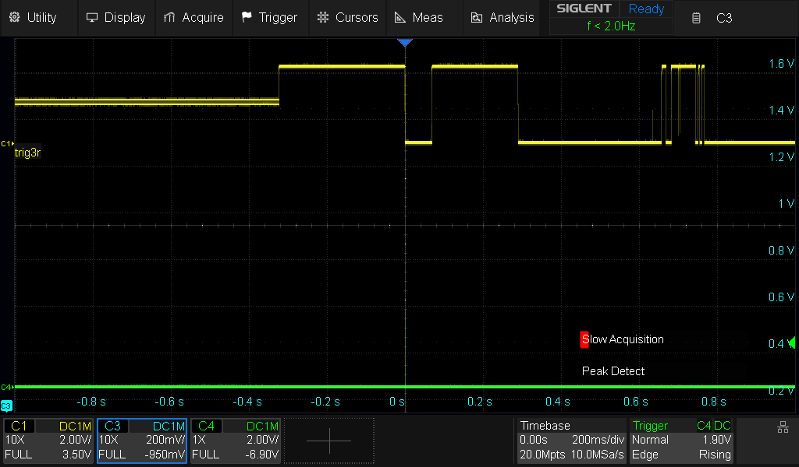

These look like the SP resetting execution, maybe because of some watchdog mechanism, sometimes halting (or looping) for a while before that happens!

### Final step: glitch campaign

I'll quickly go over this, but once we can produce a good glitch shape, all is left is to sweep how long after our trigger we want to inject the glitch (we call this the glitch offset). You just need to program your firmware to `RESET --> ARM TRIGGER --> TRIGGER FIRED --> WAIT x OFFSET ns --> INJECT GLITCH --> Increase x+1 and REPEAT` until you observe a successful glitch. For now i'm observing glitches manually on the oscilloscope and don't have further automation on the Teensy.

In this case, observable reenable glitches started to happen at around +146ns and +151ns offsets:

(this seems to change with temperature)

> Normal Execution

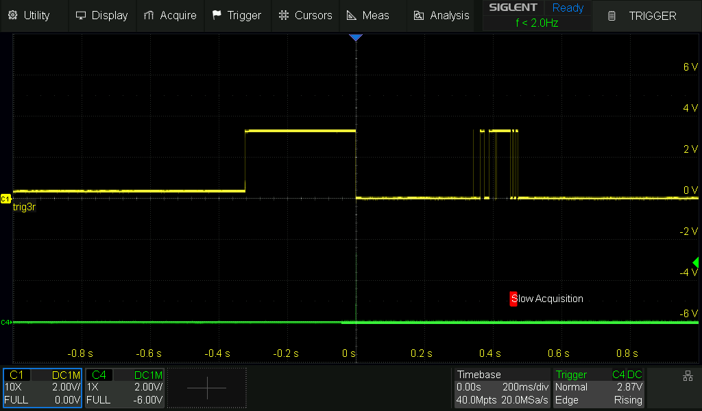

> Campaign Glitches

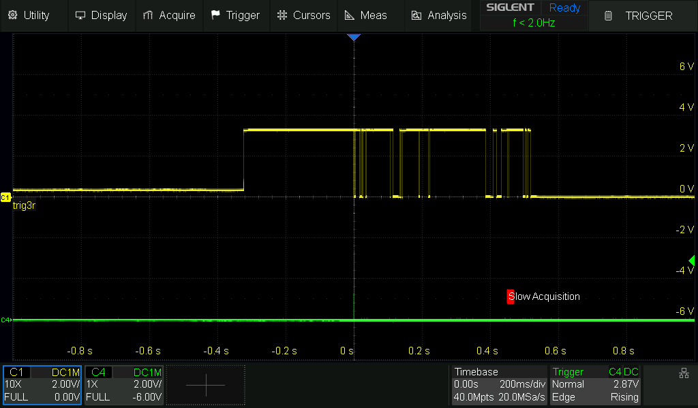

And that's pretty much it! Profit! **Glitch 1/3 achieved!.** We see the SP spew codes (well at least post<0> in the picture) during 0sp and 1sp stages, bypassing the fuses settings.

### Measuring V_NBCORE like a pro

Up to this point I've showed some V_NBCORE glitch examples but how did I measure them?

Something funny about measuring with a scope (that a few friends who work designing hardware told me long about) is how _measuring a circuit_ **changes** the circuit. The scope probes have some small capacitance (around 15-20 pF depending on the mode) which you add to the circuit wen you measure.

Also, any cables add inductance, dampening/smoothing your glitch signal. So the best thing is to measure directly at a capacitor's pad under the APU. Not on the mosfet themselves, the signal will always be good there. But on the APU side.

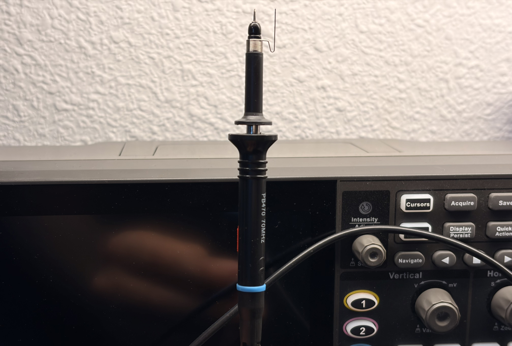

These probes that come with the scope help a lot to reduce the distance to ground as well. Be careful not to short-circuit anything. They work great! Also, X10 on your probes is recommended for these kind of signals. X10 also adds less capacitance load into the probed circuit, iirc.

### Filtering the trigger

Something i didn't mention yet is that since the beggining of the setup i had been observing noise on post<0> gpio, specially after the level shifter.

Using a simple RC filter I was able to smoothen a bit the signal comming from the  shifter early in the introspection. However, one of the capacitors I used was incorrectly labeled and it was delaaaaaying my rising/falling edges a lot:
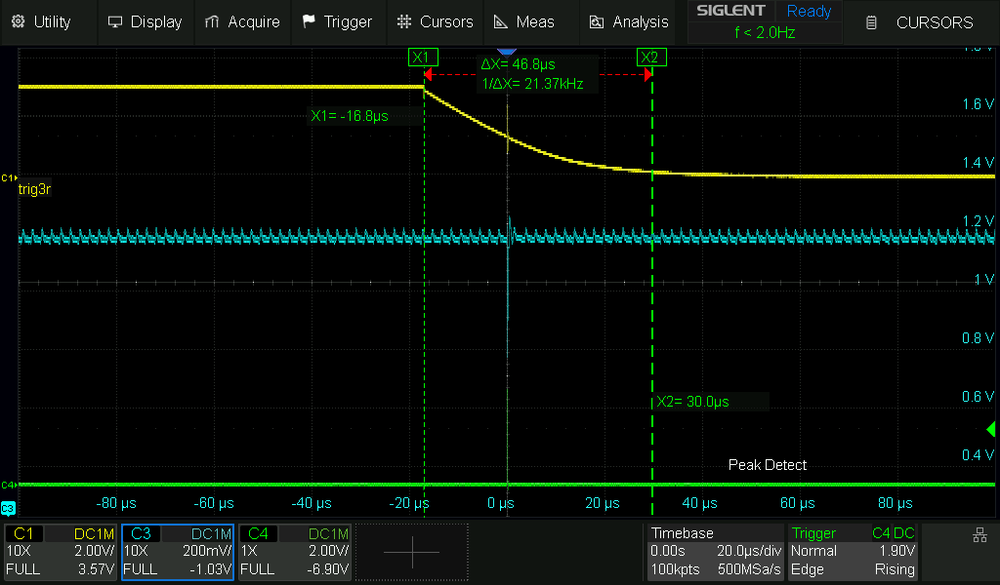

This made triggering reliably impossible. This was my missing piece for 1-2 weeks. Without the filter circuit, my Teensy would sometimes trigger before the desired falling edge, because of switching noise from the shifter, so I definitely needed it, **but i needed to improve it.**

For the successful glitch campaign above, I ended up minimizing the filter as much as possible, to reduce rise/fall (transition) time jitter, which is dictated by this equation:
`tr ​≈ 2.2 × R × C`

I used the lowest cap I had at `22 pf` and minimized the resistor to ~510 Ohm. This adds a ~130ns jitter to the normally almost immediate falling edges of post<0>, but the gains from filtering the noisy shifter signal are worth it, and the POST reenable glitch is still within bounds. For other DUTs or scenarios, a different solution might be needed.

Lower than this resistance value (e.g.: 200 Ohm, 470 Ohm), the filter still worked great, but some issues arised with the TX level shifter (fast-switching and ringing issues) that I might document at a later date.

---

Also at the beggining of the post I said i would explain how to trigger with the GPIO anchor. It's simply a pull-up resistor (so that instead of floating the signal is HIGH and you can clearly trigger on the falling edge when it goes LOW). Initially I forgot the TX level shifter had built-in pull-ups, so I added a weak pull-up resistor to 1.8v (1p8stby to be precise) on the A-side of the shifter / on the clean original post<0> signal. However that one is not needed at all with the level shifter. Also, 1p8stby rail goes down with SMC_RESET.

### Full winning circuit
It's something like this:
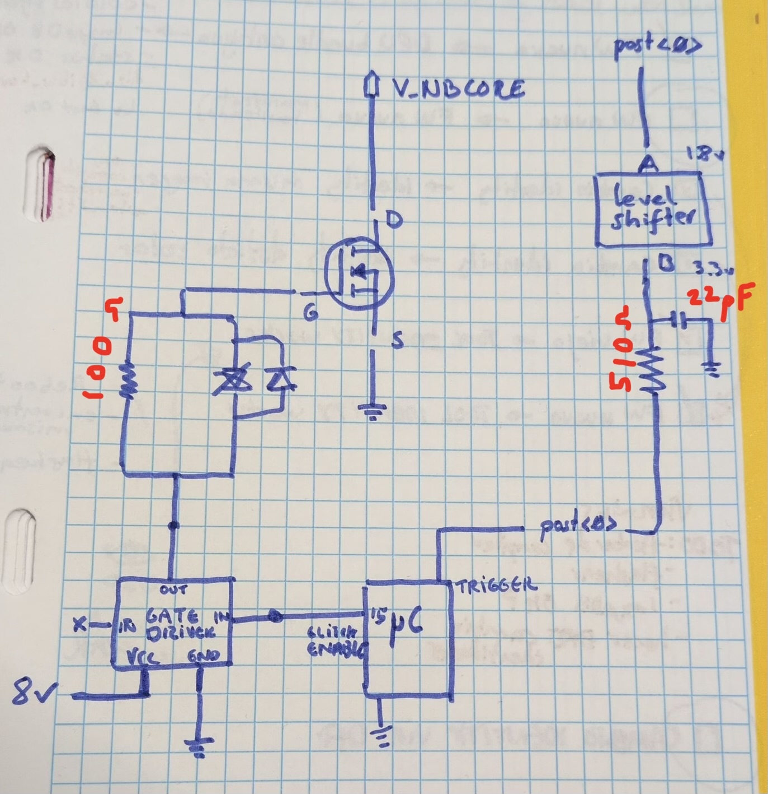

## Bonus: ERU-00 eMMC dual boot

< here be dragons > come back tomorrow for PCB files github link

## ACKs

In no special order:

- Doom for his talk
- **All the [Emp0ros](https://x.com/emp0ros) [team/community](https://discord.gg/RMm8SjG8) for their excellent contributions in reproducing the hack**
- retr0id for the kind advice with setup references
- My girlfriend for pushing me outside the house often
- The folks from the choir for also making me go outside the house
- Nitehack
- My father for passing me down his old electronic components
- All other friends who supported along the way
- Gemini
- Aliexpress

Turns out you can just do things! Ignorance is bliss

## What's next?

Not much. I'm going to take a small break to play videogames and mess with PS4 devkits to relax a tad. I'll update this post to make some corrections and upload the ERU-00 board too. I might continue with the next glitches later. Thanks for reading! See u!
