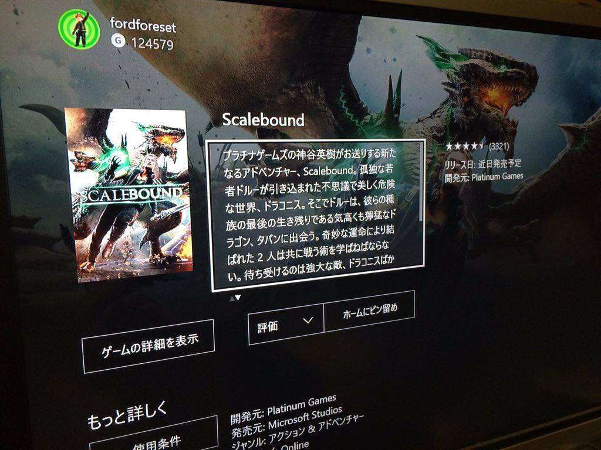
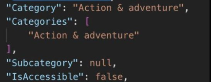
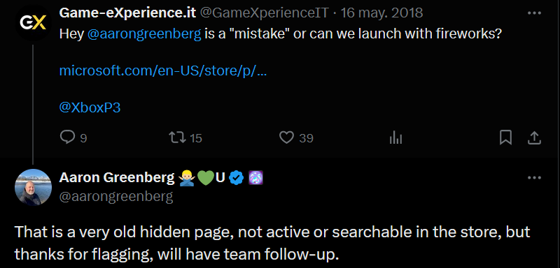
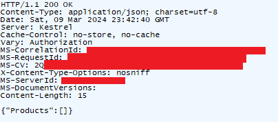

# Scalebound Lost: a game preservation failure story

 


 

> Scalebound was an action role-playing game developed by PlatinumGames from 2013 until its cancellation in 2017. It was scheduled to be released in 2017 for Windows and Xbox One, but Microsoft Studios announced its > cancellation in January 2017. In the game, players would assume control of Drew, who is accompanied by a dragon called Thuban. Players could use a variety of weapons to defeat enemies, and could issue commands to > the dragon, which assisted players during battles. Unlike other games developed by PlatinumGames, the game was to put more focus on graphical qualities and the role-playing aspect instead of action. 
- [_Scalebound Wikipedia Article_](https://en.wikipedia.org/wiki/Scalebound)

**For a cancelled game**, I was impressed with the fond memories and expectations that a lot of people online seemed to have regarding Scalebound. The game was received as a beacon of hope for a not-so-successful Xbox One console back when first announced during E3 2014, and more than a decade later, gamers still yearn for this game.

That's why earlier this year I decided to devote some time and resources into trying to find and preserve a playable build of this game. This is a small story of reverse engineering, APIs, and how we were so close to saving Scalebound from staying as lost media.

**Now, I'm sharing this story hoping that it inspires others to keep digging and investing into game preservation and specially Xbox One reverse engineering.**

## 1. Information Gathering

As in all good missions, first step is reconnaissance and knowing what we want to obtain. For me, I wanted to find Xbox One builds (a.k.a.: .xvc files) of the game. This was going to be difficult, because the game never made it to release, and possibly, not even closer. 

An idea quickly sparkled in my head. If there is any place where a build of Scalebound might reside, that has to be Xbox Live servers. Like a needle in a haystack, I didn't know where to find it. So I started somewhere: reviewing Scalebound promotional video, E3 trailers, and gameplay:

 

[](https://www.youtube.com/watch?v=RR4c3wsFsMM)

 

And soon enough, I had hit jackpot. The multiplayer video above showed three people's account playing the boss fight. I had to squint my eyes hard, but I was able to read the gamertags of these three accounts:

```
CupcakePlayso
HanADMGS
synaesthesiaJP
```

Now I had something useful! Proof that this three accounts played the game was great evidence, and a neat starting point to start making Xbox Live / Store API calls, and see what I could find.

Additionally, [this gameplay video](https://youtu.be/MHGwsufc_Vw?si=qvGHS0RKJIpu1ahh&t=288) shows two more accounts at the end, who might have played the game back in 2014:

```
PG kamiya
P3
```

Seems like Phil was having fun since 2014.

## 2. Poking the Xbox Live profiles

Account names in hand, it was time to interrogate our suspects.
Unfortunately, the two first accounts, and the seemed like empty test accounts. Nowadays, Xbox developers use a special kind of accounts with always start with the "2 Dev" prefix, are bound to a specific sandbox, and are created with an @xboxtest.com account. However, back then this mechanism didn't have widespread adoption and sometimes more manual testing / showcasing was done. This seems to be the case for these accounts, which don't seem to have any trace of having played scalebound (although the real reason behind this will be revealed at the end of the blogpost.)

The other accounts like [synaesthesiajp belonged to real developers of Platinum Games](https://twitter.com/synaesthesiajp) back in the day. P3 is, of course, Phil Spencer. These accounts led to nowhere in terms of finding more information about the Scalebound E3 demo.

## 3. The elusive store page (my personal El Dorado)

The first hint at an existing store page was given by a Twitter user of name `fordforeset` who posted this picture years ago:

 



 

Some relevant information can be extracted from this screenshot, for example, that `スケイルバウンド` is the original Japanese name of the game, that the developer name was indeed "Platinum Games" and that it was published by "Microsoft Studios". All of these are actual parameters that are returned by Xbox Live store APIs, so they could be useful towards our goal. Furthermore, the category of the game was known, so further filtering could be thought of:

 



 

To ask for a game build of a title, we need a sort of titleID: a unique number that gets assigned to every game when they are published in the store. There exist several different types of xbox store IDs, but the most common nowadays are:


| ID Type  | Example  |
|---|---|
| productID (a.k.a. bigID)  | BQ19FFKMQXXG  |
| contentID  | d4247f05-050d-49f7-b0b9-385012e844e2  |
| titleID   |  1824155023 |

Some other legacy types of IDs exist but these are mostly unused. If we were able to find any of these unique IDs, it would be possible to query Xbox Live for packages or metadata of the game. But how to obtain them?

Unfortunately, as far as I know, there isn't any API capable of querying titles based on Developer / Developer Name, so this was a dead end. Querying every single title published by Microsoft Studios and then trying to somehow filter the results by genre, name, and so on, would be a terrific bruteforce and filtering operation.

Regardless, a search was performed :) but it didn't yield any results that matched the filters based on "category" and "publisher" and the other attributes above. Dead end.

As the name of this section suggests, one way to directly and easily obtain an ID would be through the store page of the game. However, almost a decade later, the store page for Scalebound seemed to be gone forever, and finding a reference or URL to it was almost impossible.

I was about to give up, until using some google queries I stumbled upon [this tweet](https://twitter.com/aarongreenberg/status/996876612556632064):

 



 

Suddenly a rush of adrenaline invaded my bloodstream. I had found the store URL:
`https://www.microsoft.com/en-US/store/p/Scalebound/C4QM1R595G79`

Of course, the page was long taken down, specially after this exchange of messages between Aaron Greenberg, who raised the issue internally. I had hope but also a bad feeling about this. I was so close to, now I had a `productID` from the store page and I could ask Xbox Live for this game!... right?

# 4. Radio silence

To query for the game using the productID we can use the following request:
```js
POST https://catalog.gamepass.com/v3/products?market=US&language=en-US&hydration=consoledetailsruby0 HTTP/1.1
Connection: Keep-Alive
Content-Type: application/json
Accept: application/json
Accept-Encoding: gzip, deflate
Accept-Language: en-US
User-Agent: Xbox/Shell/Http
Calling-App-Context: Hydration-Product
Calling-App-Name: Console-Slim-ShellCore
Calling-App-Version: 10.0.22620.2865 (xb_flt_2211ni.221130-1745)
Content-Length: 29
Host: catalog.gamepass.com
```

With this as the body:
```js
{"Products":["BQ19FFKMQXXG"]}
```

Alternatively, this other endpoint can be used too, although it requires authentication:
```js
GET https://displaycatalog.mp.microsoft.com/v7.0/products?bigIds=9PP5G1F0C2B6&market=US&languages=en-US&fieldsTemplate=Details HTTP/1.1
Connection: Keep-Alive
Accept-Encoding: gzip, deflate
Accept-Language: en-US
Authorization: XBL3.0 x=-;eyXXXXXXXXXXXXXXXXXXXXXXXXXXXXXXXXX
User-Agent: Xbox/Shell/Http
MS-CV: YYYYYYYYYYYYYYYYYYY
Host: displaycatalog.mp.microsoft.com
```


This is the result of the queries:



It seems like the game altogether, does no longer exist in the servers of Xbox Live. Probably, due to the tweet above. Had we found this ID years ago, sooner, before that chain of tweets, we might have obtained some more information and probably early builds of the game. 

# 5. Conclusions

Unfortunately, it is crystal clear that Microsoft/Xbox removed all and every remains of Scalebound in the Xbox Live servers and store pages, most likely after Aaron Greenberg raised the alarm regarding the re-appearing Store page bug. That is why, none of the users that were proven to have played the game in the past showed any traces back to the game. This purge made it impossible to find any lost build of Scalebound, and henceforth, I declare it lost media. I would love to be proven wrong, though!

I hope you enjoyed this concise and pseudo-technical blogpost. I definitely felt like a sleuth for a few days, trying to solve this "case"!

See you online
> Torus