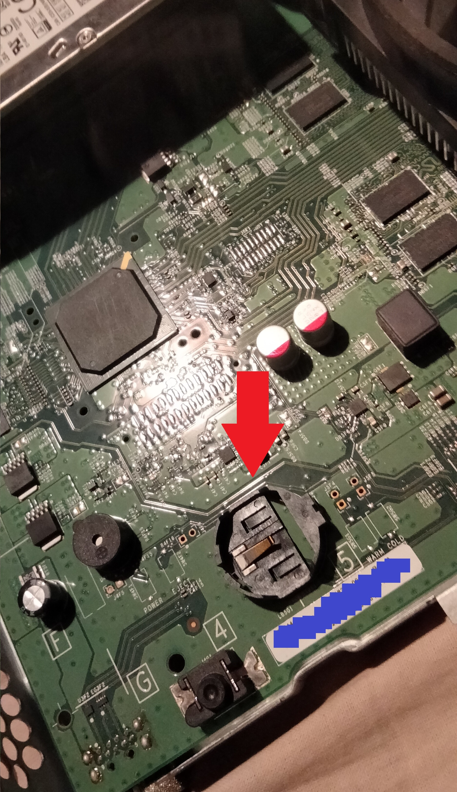

# How to activate an Xbox One ERA XDK permanently

_Another trick that shouldn't work but somehow does ;)_

## Intro

There exists a plethora of different Xbox One devkits, each flavour with its own set of quirks and a specific set of things they're designed to do. For example, the lowest tier of devkits (UWA, previously named SRA) only allows for developing apps. ERA kits allow this, plus developing full games that use all the dedicated hardware of the console. Internal kits are even more versatile, allowing for development and debugging of the Operating System(s) of the console. For a slightly more comprehensive classification of kits [check this page.](https://xboxoneresearch.github.io/wiki/console-models/devkit-types/)

Some of these kits usually share one trait, they are only activated for a limited period of time. A capability certificate is issued by Xbox Live servers, with an expiration date. Developers must keep the consoles online (at least every now and then) for the servers to generate a new certificate. If the certificate is not valid, for example its expiration date has passed, then the security processor will likely return the console to a retail mode (like a normal retail console) or partially brick it (worst case scenario) until it is connected online again.

In this quick tutorial I'll show you a way I discovered a few years ago to permanently take an ERA (or SRA) kit offline, without it ever deactivating (as long as you keep it offline). Servers might not renew devkits forever and we don't want more e-waste do we? This trick will allow you to preserve beta builds of the console, preserve content, and keep the developer console running and with development capabilities _almost_ forever. Something specially relevant given [the current state of the Xbox Brand](https://www.theverge.com/2024/5/8/24151814/microsoft-xbox-layoffs-strategy-changes-arkane-tango). To do this we're going to fuck around with the battery-powered RTC (Real Time Clock).

## Disclaimer 1

I have verified this method work on PHAT Xbox One XDKs and Xbox One S XDKs. This method should/must work with Xbox One X XDKs as well (at least the regular ERA XDK ones which have an RTC battery, there exist some rarer kits, without RTC battery in which the trick does not work in the exact same way), but I have not verified it because I lack that kind of developer hardware.

Xbox Series S/X is left as an exercise to the reader.

## Disclaimer 2

For this trick to work **your console must be renewing periodically** OR **have a valid certificate at the time you perform the trick** (even if it no longer renews).

If your XDK is banned or already deactivated and it can no longer go into ERA devmode, you're out of luck.

## Disclaimer 3 / Limitations

The trick only works in a limited set of OS versions. If your console is on an older OS than that, you can probably upgrade with an OSU or a dev update.

If your console is on a more modern OS (like latest stable OS) the trick won't work (at least it never worked for me on 2023 and 2024 OSes).

**You need your devkit to be on a 2020 or 2021 OS version**: for example around `10.0.22000.3000` (there are a lot of 10.0.22000.XXXX updates spanning multiple years, but the builds around 3000 are good to do this trick).

Downgrading an ERA kit to the golden OS version for this trick to work is possible, but that will be discussed at a later date. (Maybe a little fun challenge to those willing to experiment in the time being).

## Steps

Get thy tools ready. Thou shall want thy usual suspects: screwdrivers to teardown the console, power supply & chords, and some plastic tools to remove the RTC battery

 0. Backup your HDD and NAND!
 1. Get your console in the target OS range (e.g.: `10.0.22000.3000`)
 2. Make sure to boot into developer mode. You should be able to deploy games, enter the `Dev Home` app, and so on.
 3. Remove all WiFi networks from the console.
 4. Remove any ethernet cable from the console.
 5. In network settings, press `Go Offline` 
 6. Completely turn off your console. Not low power mode, but full shutdown. To do this, go to `Settings` / `Power and Energy` / `Full Shutdown`. Wait for your console to fully shutdown. Remove the power cable / PSU cable, and wait for at least 20-30 seconds.
 7. Open the console and remove the RTC battery (removed battery pictured below)

 8. With the battery removed, plug your PSU/cable and turn on your console.
 9. **If your console boots to Dev Home**, congratulations, you now have an infinitely activated ERA kit!. You can now develop games forever. Your system time will default to a frozen date in 2019. Since 2019 is before * insert current date here *, your console remains activated _ad infinitum_. See the _'Why?'_ section to understand how it works.
 10. _If your console boots to retail mode_: the trick didn't work, likely because of the OS version. I've tested a lot of firmwares, everything prior to 2019 fails, and so do latest OSes from 2023 and 2024. OS versions between 2020 and early 2022 seem to be the sweet spot.

## Why?
You might be wondering why this works. I will instead explain why it should **not** work and then provide a possible theory as to why magic happens.

Usually, the PSP (the secure processor) contains an RTC submodule. This is a small circuitry of the IC powered by the CMOS battery. These batteries last on average +10 years (the lifetime of a console). As long as power is supplied, the secure processor can retain the date and hour of the system, even if the main power supply isn't connected and the console isn't booted for years.

But most importantly, a date value must be authoritative. This means that, to trust and maintain a date value, it must come from a secure or trusted source. As far as I know this source of authoritative date is Xbox Live. Through digital authentication, the PSP knows if a date is "valid" and trusted, and this only happens when the console goes online and it receives the date from Xbox Live. If you manually change the date/time of your console the console shall not trust that you are a good user and you are not taking the console "back in time" :) so the PSP will ignore that date.

Unfortunately, if power is ever completely lost, the console cannot trust any value. In this scenario we say that the console does not have an authoritative date and time. Damnit. If the Xbox doesn't know what day it is, _how is it going to verify that your certificate isn't expired?_ Well, **it can't** verify it in any way. In this scenario, the developers chose to delete the capabilities certificate and revert the console to retail mode. _"If we cannot verify that the developer capabilities are not expired, we cannot let the developer options work! But at least, let's not brick the console"_. I like to imagine the Xbox One developers thought something like that.

This is a reasonable design decision and it would 100% prevent expired devkits from operating. The system defaults to some base date in the past, and then the system keeps working, but with limited functionality, in retail mode. This is the behavior you observe in 2018 OSes and latest OSes 👍 we good

However, **around 2020 something happened** and instead, the system will trust a non-authoritative time value? My personal theory is they loosened the PSP checks for some reason, either due to constrains related to the Series S/X launch, or maybe due to the Covid19 pandemic, when developers had to work from home and couldn't access their corporate networks, which were IP-whitelisted to renew their devkits, or perhaps it was just to please SRA users making their consoles not deactivate every so often. Who knows!

## Closure and Acknowledgement

- Many thanks to Jonttufin for helping me with the initial experiments back a few years ago.

- Also thanks to the XBResearch team for maintaining the wiki while I'm here taking some vacation ;)

- Follow me on [X (formerly Twitter)](https://twitter.com/TorusHyperV) or on [Youtube](https://www.youtube.com/@TorusHyperV) and let me know if the trick works for you! 
